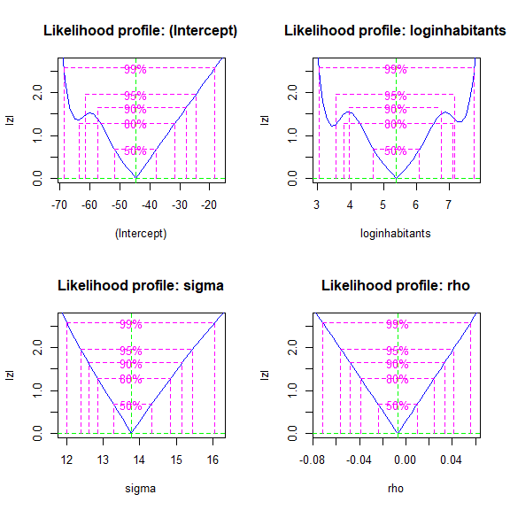

<!-- README.md is generated from README.Rmd. Please edit that file -->

# llsar

Estimando os parâmetros de um Modelo SAR (Spatial AutoRegressive) por
máxima verossimilhança.

<!-- badges: start -->

[](https://www.tidyverse.org/lifecycle/#experimental)
[](https://CRAN.R-project.org/package=llsar)
[](https://travis-ci.com/evandeilton/llsar)
<!-- badges: end -->

## Instalação

O pacote pode ser instalado diretamente pelo
[GitHub](https://github.com/) com:

``` r
# install.packages("devtools")
devtools::install_github("evandeilton/llsar")
```

## Vinheta

Para o estudo detalhado vejas a vinheta.

``` r
vignette(topic = "llsar", package = "llsar")
```

## Exemplos

### Carregando dados

``` r
# Pacotes
if(!require(tidyverse)){install.packages("tidyverse")}
if(!require(bbmle)){install.packages("bbmle")}
if(!require(llsar)){devtools::install_github("evandeilton/llsar")}

# Dados
data("rio_tiroteio", package = "llsar")

# Shapes
data("rio_shape", package = "llsar")

# A: Matriz de proximidades/adjacências
data("rio_proximidades", package = "llsar")
A <- rio_proximidades
```

### Ajuste do modelo CAR com uma covariável numericamente

``` r
system.time({
  a1 <- fit_newton(lvero = sar_reg_lvero_dmvnorm, 
                   gr = sar_reg_gradiente_numerico, 
                   hess = sar_reg_hessiano_numerico,
                   formula = count ~ loginhabitants, dados = rio_tiroteio, A = A, verbose = F)
  fit1 <- fit_quasi_newton(a1)
  fit1_profile <- bbmle::profile(fit1) 
})
#>    user  system elapsed 
#>   41.75    0.00   41.79
```

### Ajuste do modelo CAR com uma covariável algebricamente

``` r
system.time({
  a1 <- fit_newton(lvero = sar_reg_lvero_analitico, 
                   gr = sar_reg_gradiente_analitico, 
                   hess = sar_reg_hessiano_analitico,
                   formula = count ~ loginhabitants, dados = rio_tiroteio, A = A, verbose = F)
  fit1 <- fit_quasi_newton(a1)
  fit1_profile <- bbmle::profile(fit1)
})
#>    user  system elapsed 
#>   21.67    0.00   21.67
```

### Estatísticas

``` r
plot(fit1_profile)
```

<div class="figure" style="text-align: center">


<p class="caption">
Perfis de verossimilhança
</p>

</div>

Por fim a Tabela 3 mostra as estimativas dos parâmetros e todos, exceto
*ρ* possuem forte significância com p.valor próximo de zero com
intervalo de confiança de 95%.

``` r
tidy(fit1) %>% 
  bind_cols(
    confint(fit1, method = "quad") %>% 
      as.data.frame()
  ) %>% 
  knitr::kable(digits = 4, 
               caption = "MLE modelo sem covariáveis", 
               row.names = F,
               col.names = c("term", "estimate", "se", "z.value", "p.value", "ci2.5","ci97.5")) 
```

| term           | estimate |      se | z.value | p.value |    ci2.5 |   ci97.5 |
|:---------------|---------:|--------:|--------:|--------:|---------:|---------:|
| (Intercept)    | -44.7060 | 10.1718 | -4.3951 |  0.0000 | -64.6424 | -24.7696 |
| loginhabitants |   5.3938 |  1.0054 |  5.3650 |  0.0000 |   3.4233 |   7.3643 |
| sigma          |  13.7830 |  0.7730 | 17.8302 |  0.0000 |  12.2679 |  15.2981 |
| rho            |  -0.0071 |  0.0248 | -0.2854 |  0.7753 |  -0.0557 |   0.0416 |

MLE modelo sem covariáveis

### Preditos

``` r
covaria <- sar_reg_predict(fit1) %>% rename("pred_c" = pred)

predis  <- rio_tiroteio %>% 
  dplyr::select(id = CODBAIRRO, bairro = neighborhood, count) %>% 
  dplyr::inner_join(covaria, by = "id") %>% 
  dplyr::arrange(desc(count))

bind_cols(medida = c("observado","predcovariavel"),
          bind_rows(rio_tiroteio %>% pull(count) %>% quantile(probs = seq(0, 1, 0.10)),
                    covaria %>% pull(pred_c) %>% quantile(probs = seq(0, 1, 0.10))) %>% 
            round() %>% as.data.frame()) %>% 
  knitr::kable(caption = "Decis da variável resposta count.", 
               row.names = FALSE)
```

| medida         |  0% | 10% | 20% | 30% | 40% | 50% | 60% | 70% | 80% | 90% | 100% |
|:---------------|----:|----:|----:|----:|----:|----:|----:|----:|----:|----:|-----:|
| observado      |   0 |   0 |   0 |   1 |   2 |   4 |   6 |   9 |  14 |  27 |  101 |
| predcovariavel | -17 |   3 |   5 |   7 |   9 |  10 |  11 |  13 |  14 |  16 |   24 |

Decis da variável resposta count.
